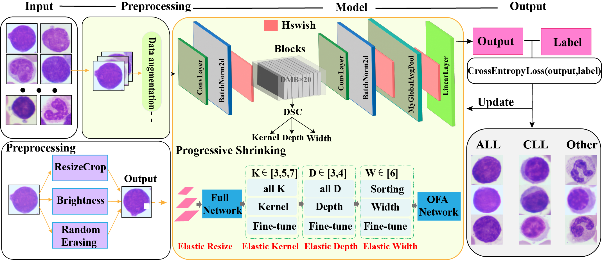
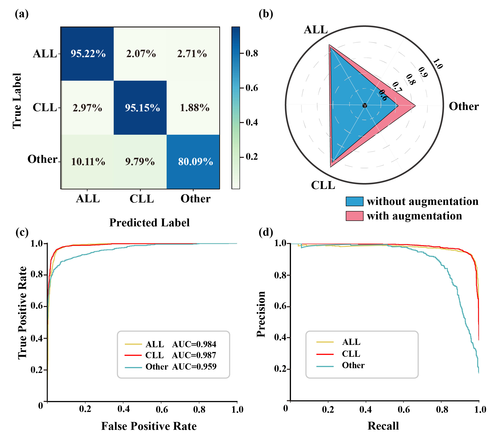

# High-accuracy and lightweight Image Classification Network for optimizing lymphoblastic Leukemia diagnosis

⭐ our [article](http://doi.org/10.1002/jemt.24704) ⭐ 

<p align="center">  </p>

If our work is helpful to you, please cite:
```
@article{
  title={High-Accuracy and Lightweight Image Classification Network for Optimizing Lymphoblastic Leukemia Diagnosisy},
  author={Liye Mei, Chentao Lian, Suyang Han, Shuangtong Jin, Jing He, Lan Dong, Hongzhu Wang, Hui Shen, Cheng Lei, Bei Xiong},
  journal={Microscopy Research and Technique},
  year={2024},
  publisher={WILEY}
}
```

## Data
LLC-2024 dataset
<p>The proposed LLC-2024 dataset is available at 
https://data.mendeley.com/preview/wydknkk5k2?a=dc639e37-60ad-45a1-a7b8-3f5477e330d8</p>


## Results

| Classes | Precision (%) | | Recall (%) | | F1 Score (%) | | Images | |
|---------|:-------------:|:-------------:|:------------:|:------------:|:-----------:|:------------:|:-----------:|:------------:|
|         | Validation | Test | Validation | Test | Validation | Test | Validation | Test |
| ALL     | 91.30       | 93.35 | 93.69    | 95.22 | 92.48    | 94.28 | 1411       | 1549 |
| CLL     | 94.11       | 93.32 | 94.51    | 95.15 | 94.31    | 94.23 | 1438       | 1381 |
| Other   | 84.48       | 88.17 | 78.62    | 80.09 | 81.30    | 83.94 | 650        | 633  |
| Overall | 91.13       | 92.42 | 91.22    | 92.51 | 91.15    | 92.42 | 3499       | 3563 |


Quantitative analysis of cell classification results are as follows:

<p align="center">  </p>


If you have any question, please contact me email at (102301204.hbut.edu.cn)
